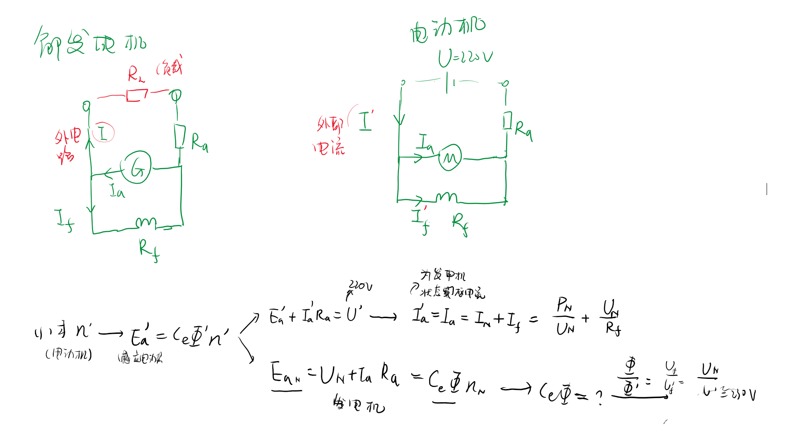

<!--
 * @Author: 小叶同学
 * @Date: 2024-03-17 20:55:14
 * @LastEditors: Please set LastEditors
 * @LastEditTime: 2024-03-18 14:28:18
 * @Description: 请填写简介
-->
一台并励直流发电机,铭牌数据如下：PN=23kW，UN=230V，nN=1500r/min，励磁回路电阻Rf=57.5Ω，电枢电阻Ra=0.1Ω，不计电枢反应和磁路饱和。现将这台电机改为并励直流电动机，把电枢两端和励磁绕组两端都接到220V的直流电源上，运行时维持电枢电流为原额定值，试求电动机的下列数据： 

（1）转速n；（2）电磁转矩；（3）电磁功率

*CORE*第一章计算题。课本计算题。

