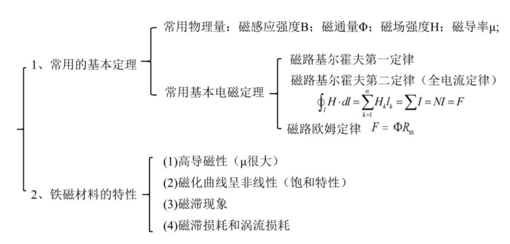
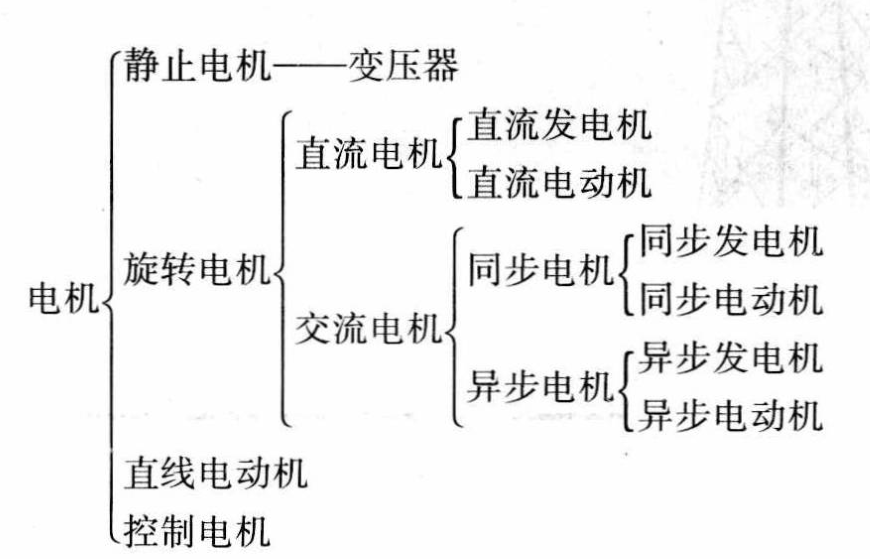
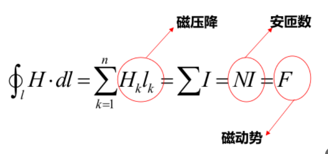
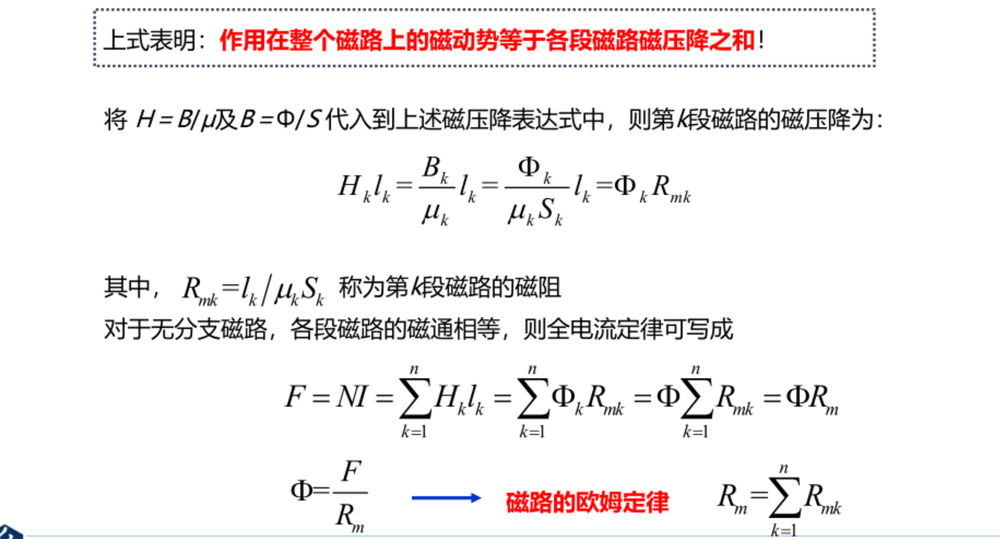
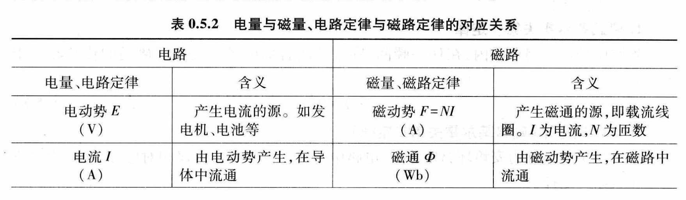
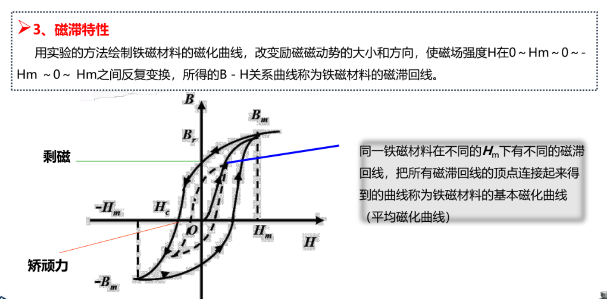
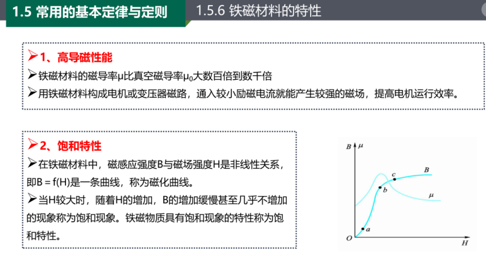

- 电机
  - 发电机
  - 电动机
  - 变压器
  - 控制电机（微控电机）

## 与电机相关的基本定律

- 电磁感应定律（发电机）
  - 变压器电动势$e = -\frac{d\varPsi}{dt} = -N\frac{d\phi}{dt}$
  - 切割电动势$e = Blv$
- 安培定律（电磁力定律）$F = BlI$
- 安培环路定律（全电流定律）$ \oint_l  H\cdot dl= \sum I$

---

- 电磁感应定律
  - 感生电动势
  - 动生电动势

- 铁磁材料的特性
  - 高磁导性能
  - 饱和特性
  - 磁滞特性
  - 铁芯损耗

磁化曲线(H,B之间的关系)

