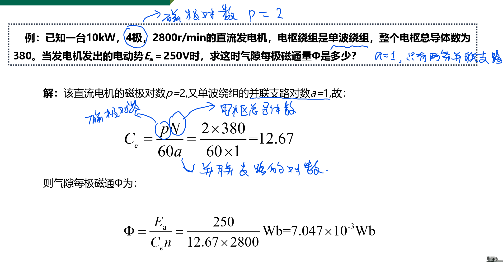
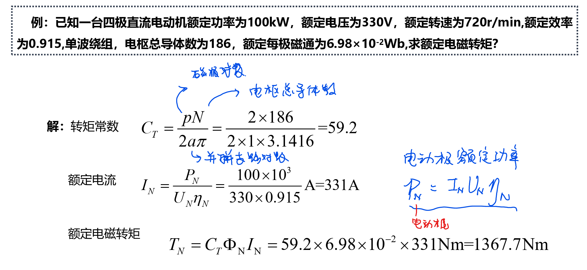
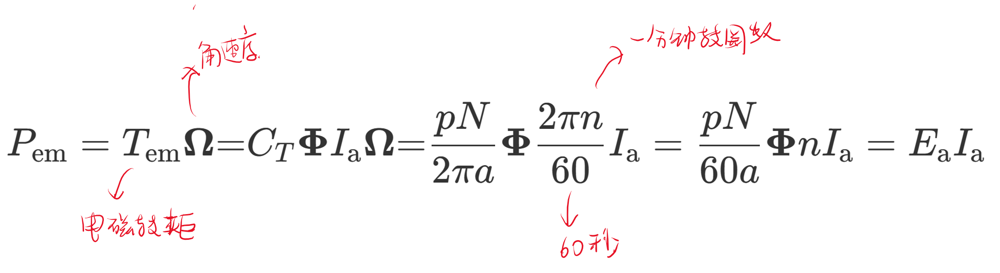

# 直流电机的电枢电动势和电磁转矩

<!-- @import "[TOC]" {cmd="toc" depthFrom=1 depthTo=6 orderedList=false} -->

<!-- code_chunk_output -->

- [直流电机的电枢电动势和电磁转矩](#直流电机的电枢电动势和电磁转矩)
  - [1 电枢电动势](#1-电枢电动势)
    - [1.1 例题](#11-例题)
  - [2 电磁转矩](#2-电磁转矩)
    - [2.1 例题](#21-例题)
  - [3 直流电机的电磁功率](#3-直流电机的电磁功率)

<!-- /code_chunk_output -->

- **单薄绕组 a = 1**
- **单叠绕组 a = p（磁极对数）**

TODO 在直流电动机中单叠绕组，单薄绕组个数分别是多少？

## 1 电枢电动势

- **直流电机的电动势常数**
    $$C_e=\frac{pN}{60a}$$

- **电枢电动势**
    $$E_a = C_e\Phi n$$

### 1.1 例题

## 2 电磁转矩

- **定义**：电枢绕组中有电枢电流流过时,在磁场内受电磁力的作用，该力与电枢铁心半径之积称为
电磁转矩

- **电磁转矩**
    $$T = C_T\text{Ф}I_\mathfrak{a}$$

- **直流电机的转矩常数**
    $$C_T=\frac{pN}{2\pi a}$$

### 2.1 例题

## 3 直流电机的电磁功率

- **电磁功率**
    $$P_{\mathrm{em}}=T_{\mathrm{em}}\boldsymbol{\Omega}{=}C_{T}\boldsymbol{\Phi}I_{\mathrm{a}}\boldsymbol{\Omega}{=}\frac{pN}{2\pi a}\boldsymbol{\Phi}\frac{2\pi n}{60}I_{\mathrm{a}}=\frac{pN}{60a}\boldsymbol{\Phi}nI_{\mathrm{a}}=E_{\mathrm{a}}I_{\mathrm{a}}$$

    