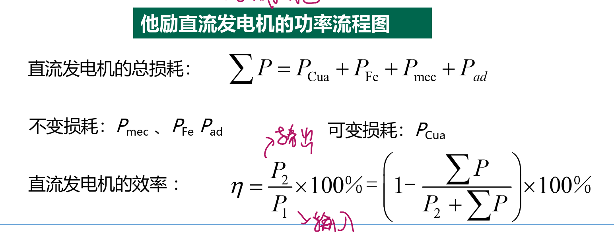

<!--
 * @Author: 小叶同学
 * @Date: 2024-03-07 14:53:50
 * @LastEditors: 
 * @LastEditTime: 2024-03-11 14:08:41
 * @Description: 请填写简介
-->
# 直流发电机

<!-- @import "[TOC]" {cmd="toc" depthFrom=1 depthTo=6 orderedList=false} -->

<!-- code_chunk_output -->

- [直流发电机](#直流发电机)
  - [1 直流电机的励磁方式](#1-直流电机的励磁方式)
  - [2 直流发电机的基本方程](#2-直流发电机的基本方程)
    - [2.1 电动势平衡方程](#21-电动势平衡方程)
    - [2.2 转矩平衡方程](#22-转矩平衡方程)
    - [2.3 功率平衡方程](#23-功率平衡方程)
  - [3 运行特性](#3-运行特性)
    - [3.1 空载特性](#31-空载特性)
    - [3.2 外特性](#32-外特性)
    - [3.3 调节特性](#33-调节特性)
  - [4 例题](#4-例题)

<!-- /code_chunk_output -->

## 1 直流电机的励磁方式

1. **他励**：直流电机的励磁电流由其它直流电源单独供给。

    

2. **自励**
   1. **并励**
        $$\color{red}{I_a=I+I_f}$$
        
   2. 串励

        
   3. 复励

        

## 2 直流发电机的基本方程

### 2.1 电动势平衡方程

- $$E_a=U+I_aR_a+2AU_b\approx U+I_aR_a$$

### 2.2 转矩平衡方程

- $$\color{red}{T_1=T_{em}+T_0}$$

### 2.3 功率平衡方程

- $$P_{1}=P_{em}+P_{0}$$

[ ] 

## 3 运行特性

### 3.1 空载特性

$$\begin{aligned}U_0&=E_\mathrm{a}=C_e\Phi n\to U_0\propto\Phi\\U_0&\to I_\mathrm{f}\Leftrightarrow\Phi\to I_\mathrm{f}\end{aligned}$$

### 3.2 外特性

### 3.3 调节特性

## 4 例题

