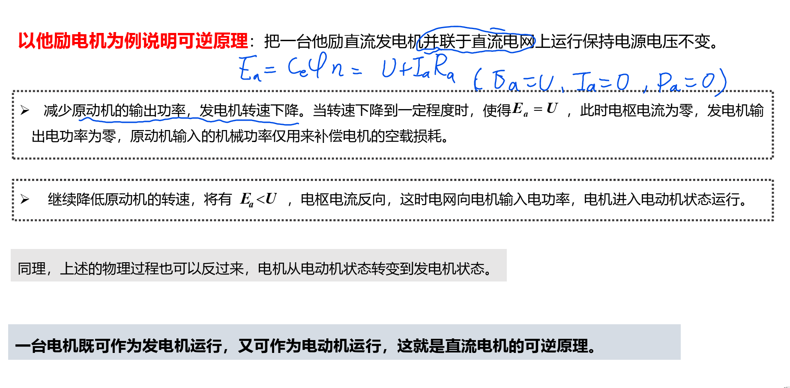
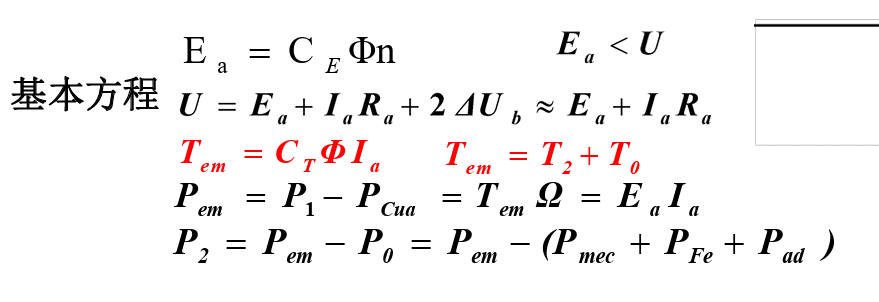

<!--
 * @Author: 小叶同学
 * @Date: 2024-03-11 14:21:33
 * @LastEditors: Please set LastEditors
 * @LastEditTime: 2024-03-11 15:12:11
 * @Description: 请填写简介
-->

# 直流电动机

### 1 可逆性

### 2 平衡方程

#### 3 工作特性

