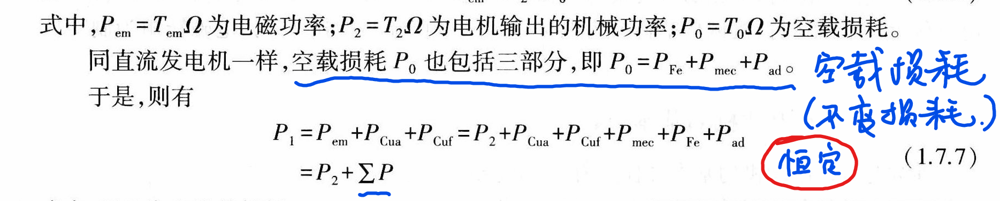
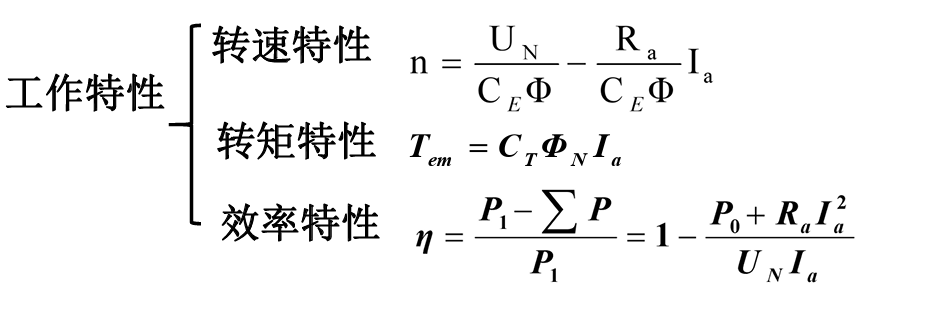

<!--
 * @Author: 小叶同学
 * @Date: 2024-03-11 14:21:33
 * @LastEditors: Please set LastEditors
 * @LastEditTime: 2024-03-20 17:16:49
 * @Description: 请填写简介
-->

# 直流电动机
- **电磁转矩**
    $$T = C_T\text{Ф}I_\mathfrak{a}$$

- **电枢电动势**
    $$E_a = C_e\Phi n$$

### 1 可逆性

### 2 平衡方程
- **电磁转矩**
    $$T = C_T\text{Ф}I_\mathfrak{a}$$

- **电枢电动势**
    $$E_a = C_e\Phi n$$
    

#### 3 工作特性

