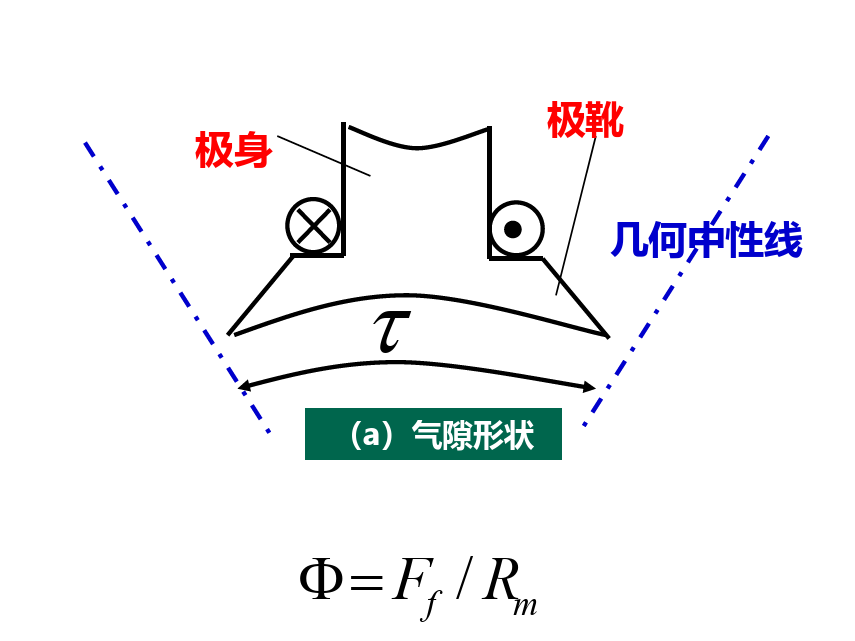

# 电枢反应

## 1 空载磁场

直流电机工作中，主磁极产生主极磁动势，电枢电流产生电枢磁动势。电枢磁动势对主极磁动势的影响称为**电枢反应**

空载磁场：就是主磁场，不带负载。

直流电机中，主磁通是主要的，它能在电枢绕组中感应电动势或产生电磁转矩，而漏磁通没有这个作用，它只是增加主磁极磁路的饱和程度。在数量上，漏磁通比主磁通小得多，大约是主磁通的20%。

几何中心线：两个相邻磁极的正中心

空载磁化特性：

## 2 负载磁场

## 3 电枢反应

- 电枢反应的作用：
    1. 使气隙磁场发生畸变
    2. 对主磁场起去磁作用

