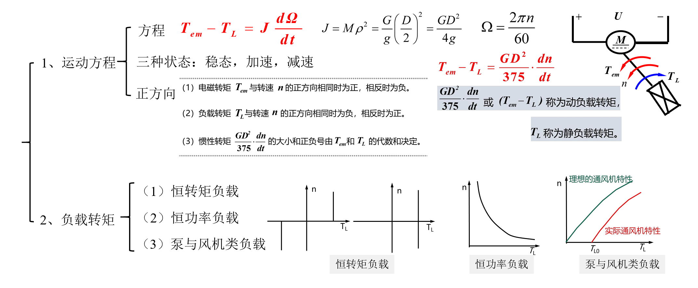
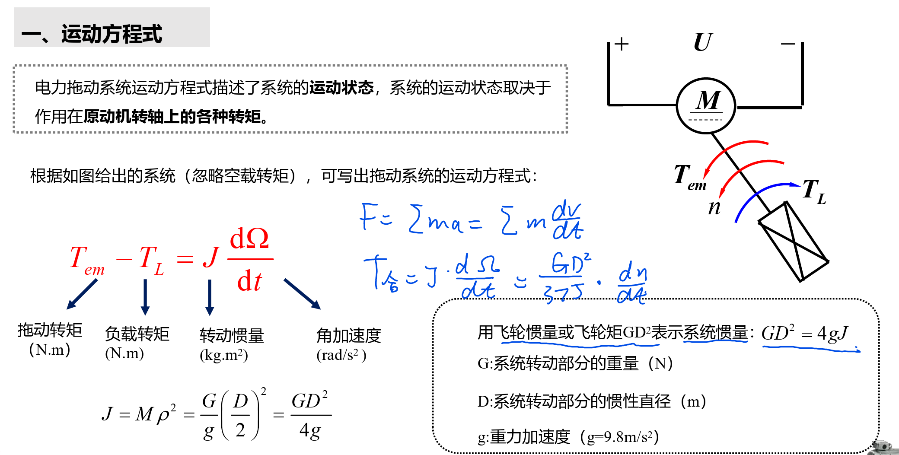
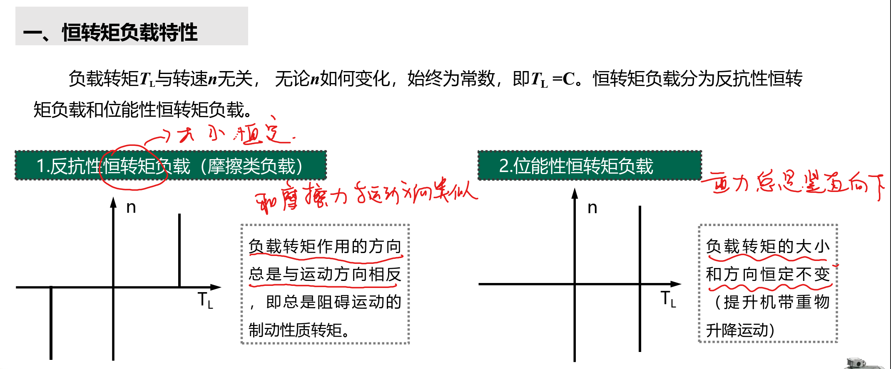
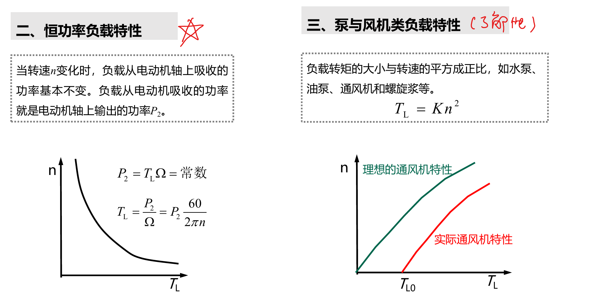

<!--
 * @Author: 小叶同学
 * @Date: 2024-03-11 15:20:27
 * @LastEditors: Please set LastEditors
 * @LastEditTime: 2024-03-11 15:33:36
 * @Description: 请填写简介
-->
# 运动方程和负载转矩特性

<!-- @import "[TOC]" {cmd="toc" depthFrom=1 depthTo=6 orderedList=false} -->

<!-- code_chunk_output -->

- [运动方程和负载转矩特性](#运动方程和负载转矩特性)
  - [1 电力拖动系统的运动方程式](#1-电力拖动系统的运动方程式)
  - [2 负载的转矩特性](#2-负载的转矩特性)

<!-- /code_chunk_output -->

## 1 电力拖动系统的运动方程式

## 2 负载的转矩特性

1. 恒转矩特性
   1. 反抗性
   2. 位能性
2. 恒功率
3. 泵与风机类负载

