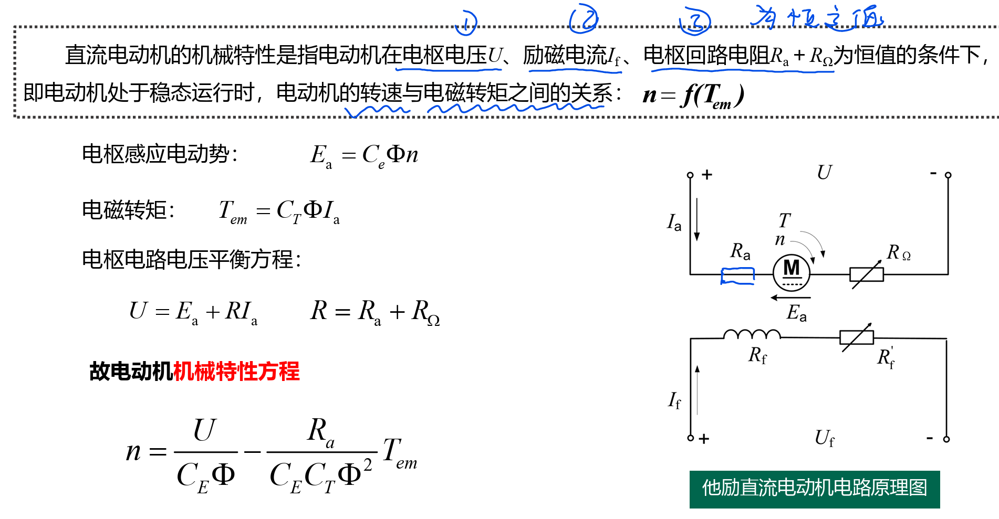
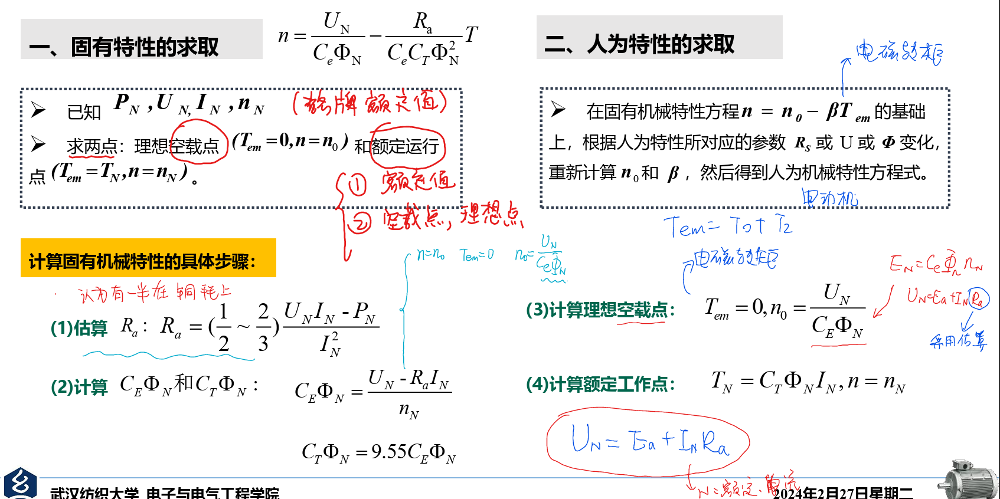
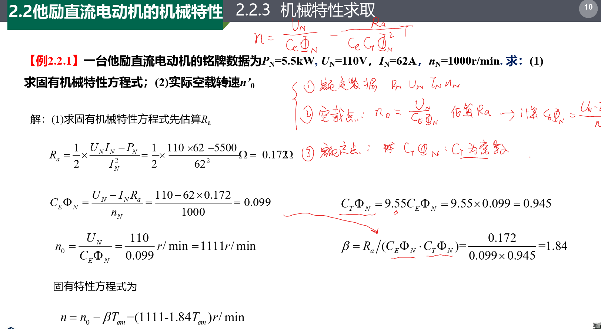
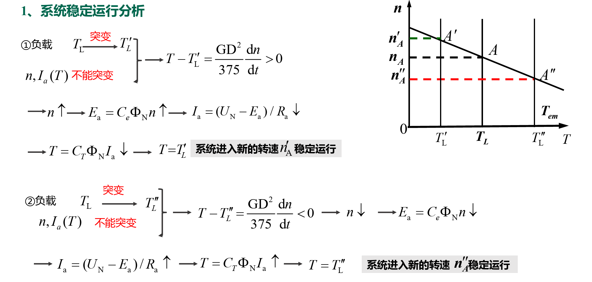
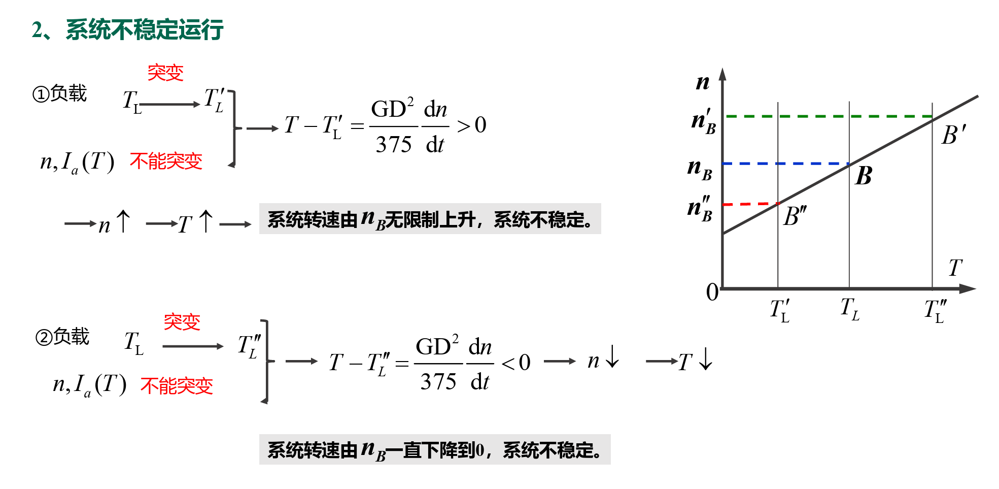
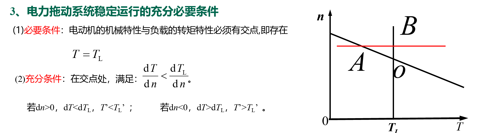

<!--
 * @Author: 小叶同学
 * @Date: 2024-03-13 15:58:47
 * @LastEditors: Please set LastEditors
 * @LastEditTime: 2024-03-13 17:30:00
 * @Description: 请填写简介
-->
# 他励直流电动机的机械特性

<!-- @import "[TOC]" {cmd="toc" depthFrom=1 depthTo=6 orderedList=false} -->

<!-- code_chunk_output -->

- [他励直流电动机的机械特性](#他励直流电动机的机械特性)
  - [1 机械特性](#1-机械特性)
  - [2 机械特性求取](#2-机械特性求取)
    - [2.1 例题](#21-例题)
  - [3 电力拖动系统稳定运行条件](#3-电力拖动系统稳定运行条件)
    - [3.1 稳定](#31-稳定)
    - [3.2 不稳定](#32-不稳定)
    - [3.3 条件](#33-条件)

<!-- /code_chunk_output -->

## 1 机械特性

- 机械特性
  - 固有特性
  - 人为特性
    - 该电阻
    - 该端电压
    - 改磁通

## 2 机械特性求取

### 2.1 例题

core 
**注意看PPT例题，为重点**

## 3 电力拖动系统稳定运行条件

处于某一转速下运行的电力拖动系统，由于受到某种扰动，导致系统的转速发生变化而离开原来的平衡状态，如果系统能在新的条件下达到新的平衡状态，或者当扰动消失后系统回到原来的转速下继续运行，则系统是稳定的，否则系统是不稳定的。

### 3.1 稳定

机械特性是下潜的

### 3.2 不稳定

机械特性是上升的

### 3.3 条件

