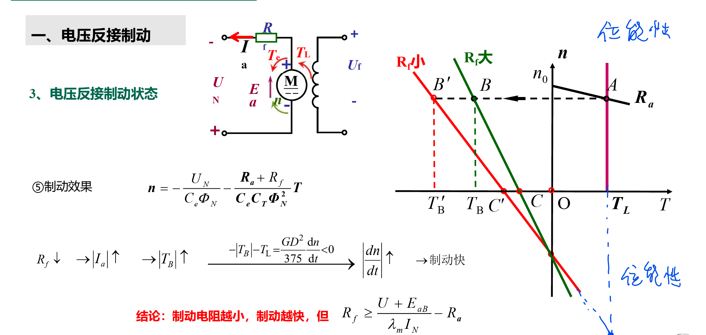

<!--
 * @Author: 小叶同学
 * @Date: 2024-03-18 14:56:30
 * @LastEditors: Please set LastEditors
 * @LastEditTime: 2024-03-20 16:37:09
 * @Description: 请填写简介
-->

        
# 他励直流电动机的制动

<!-- @import "[TOC]" {cmd="toc" depthFrom=1 depthTo=6 orderedList=false} -->

<!-- code_chunk_output -->

- [他励直流电动机的制动](#他励直流电动机的制动)
  - [0 基本概念](#0-基本概念)
  - [1 能耗制动](#1-能耗制动)
    - [1.1 机械特性](#11-机械特性)
  - [2 反接制动](#2-反接制动)
    - [2.1 电压反接制动](#21-电压反接制动)
    - [2.2 倒拉反转运行（转速反向的反接制动](#22-倒拉反转运行转速反向的反接制动)
      - [2.2.1 机械特性](#221-机械特性)
    - [2.3 回馈特性](#23-回馈特性)
  - [3 回馈制动](#3-回馈制动)
  - [要点](#要点)

<!-- /code_chunk_output -->

## 0 基本概念

## 1 能耗制动

//CORE

- 摩擦类恒转矩负载（反抗性恒转矩负载）
- 位能性恒转矩负载

### 1.1 机械特性

机械特性变成了过原点的直线

## 2 反接制动

- 电压反接制动
- 倒拉反转运行（转速反向的反接制动

### 2.1 电压反接制动

### 2.2 倒拉反转运行（转速反向的反接制动

#### 2.2.1 机械特性

### 2.3 回馈特性

## 3 回馈制动

## 要点

1. 电路怎么变
2. 机械特性
3. 运动状态（带负载运动）
   1. 磨擦类
   2. 位能性
4. 制动电阻的计算

