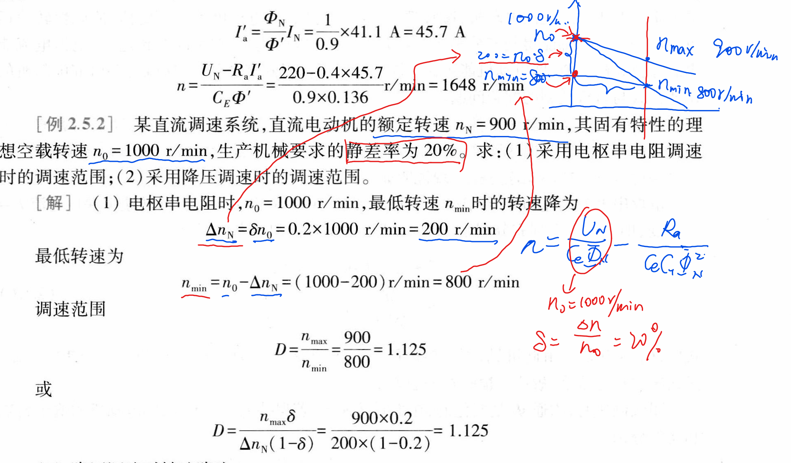

<!--
 * @Author: 小叶同学
 * @Date: 2024-03-20 17:26:57
 * @LastEditors: Please set LastEditors
 * @LastEditTime: 2024-03-20 17:27:01
 * @Description: 请填写简介
-->

# 他励直流电动机的调速

## 1 评价指标

1. 调速范围D:
2. D与δ
3. 平滑性
4. 经济性

## 2 调速方法

1. 串电阻
2. 调压调速
3. 弱磁调速

## 3 调速方式和负载类型配合

1. 恒转矩调速：（恒转矩负载）
   1. 串电阻
   2. 调压
2. 恒功率调速：（恒功率负载）
   1. 弱磁调速

## 4 例题

*CORE
课本87面5.1.2

### 4.1 

### 4.2 

