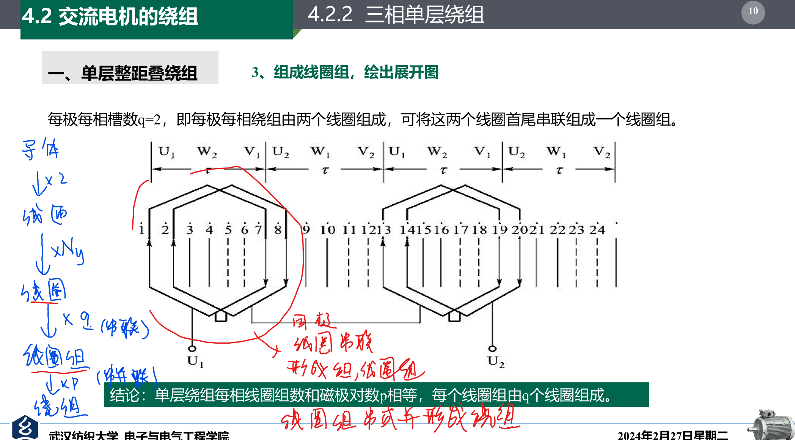

# 交流电机的绕组

- 直流电机
  - 电枢 -> 转子
- 交流电机
  - 电枢 -> 定子

1. 机械电角度
2. 空间电角度 = P 对磁极 $\times$ 机械电角度
3. 360°的空间电角度
4. 节距（两个线圈之间含有的节距(槽数)）$y$
5. 极距$\tau = \frac{z}{2p}$
6. 每极每相槽数$q = \frac{z}{2pn}$
7. 槽距角（空间电角度平分到每个槽）$\alpha = \frac{p\times 360^\circ}{z}$
8. 相带（磁极分给每个相，用电角度表示）$60^\circ $

