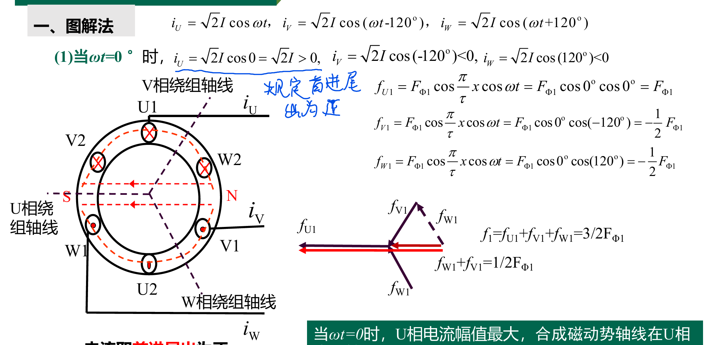

# 交流电机绕组的磁动势

- 目标
  - 相绕组的磁动势
  - 旋转磁场的产生原因

<!-- @import "[TOC]" {cmd="toc" depthFrom=1 depthTo=6 orderedList=false} -->

<!-- code_chunk_output -->

- [交流电机绕组的磁动势](#交流电机绕组的磁动势)
  - [1 单相绕组产生的磁动势](#1-单相绕组产生的磁动势)
  - [2 三项绕组的磁动势（旋转磁动势）](#2-三项绕组的磁动势旋转磁动势)
    - [2.1 图解法](#21-图解法)
    - [2.2 数学分析法](#22-数学分析法)
  - [3 总结](#3-总结)

<!-- /code_chunk_output -->

## 1 单相绕组产生的磁动势

P为磁极对数

脉振磁动势：

## 2 三项绕组的磁动势（旋转磁动势）

### 2.1 图解法

定子绕组，通入三项交流电（uvw）

**效果上来看磁场在顺时针旋转，大小不变**
单项磁场是不旋转的脉动磁场，但是三项合成后变成了旋转磁场。

磁场是从相位超前的转到相位滞后的，当我们任意交换两项时候，磁场将会反转。

### 2.2 数学分析法

显然我们只需要把上面的图解法离散取值设为t

## 3 总结

