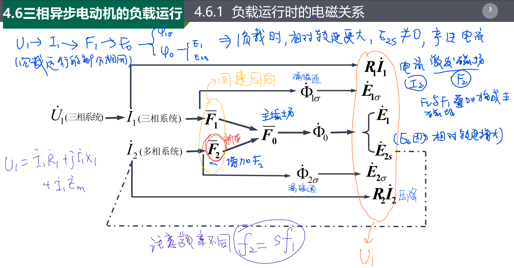
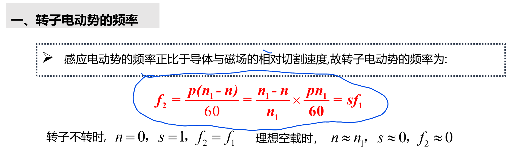
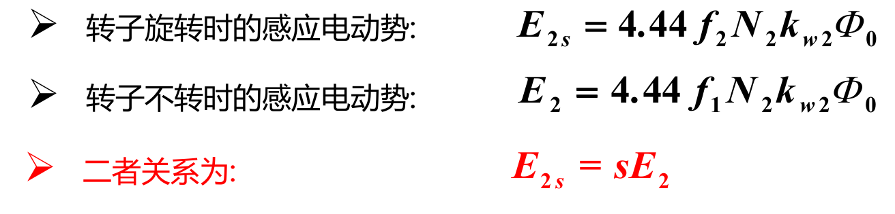
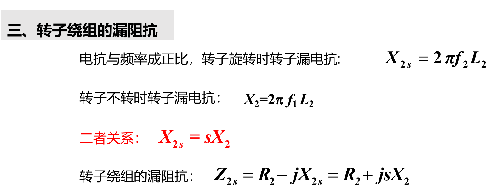
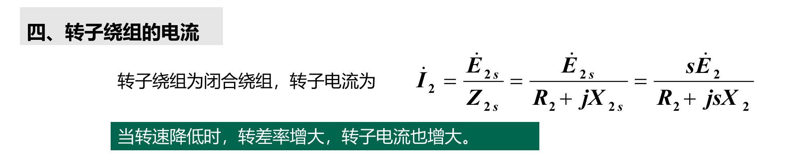
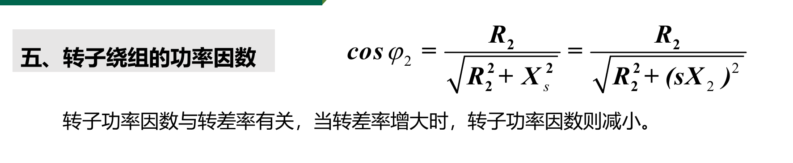
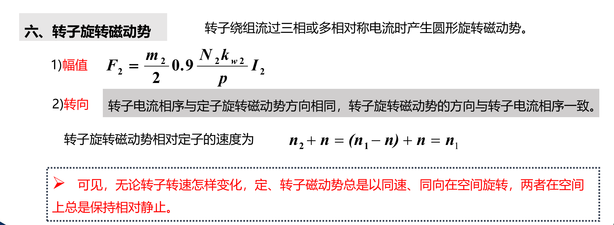
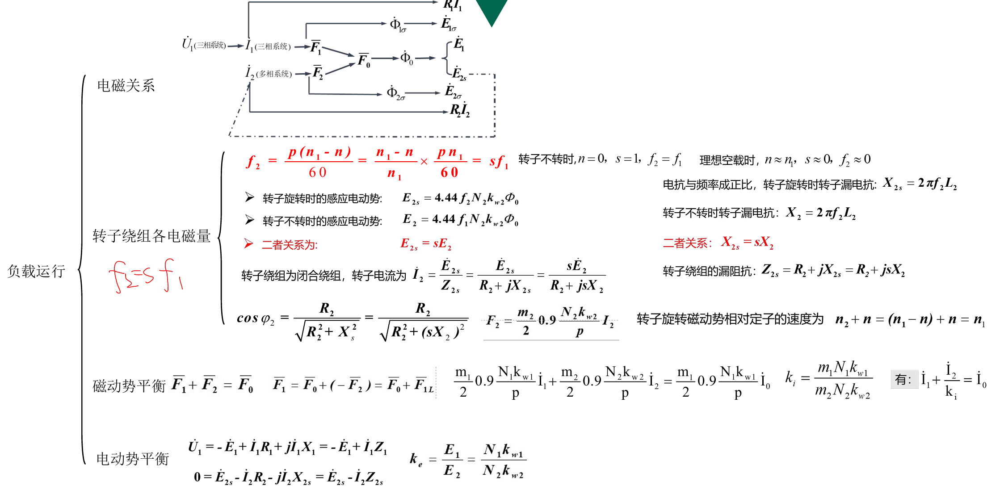

# 4.6 三相异步电动机的负载运行

## 1 频率

$$f_2=\frac{p(n_1-n)}{60}=\frac{n_1-n}{n_1}\times\frac{pn_1}{60}=sf_1$$

## 2 电动势

## 3 阻抗

## 4 电流

## 5 功率因数

## 6 旋转电动势

**可见，无论转子转速怎样变化，定、转子磁动势总是以同速、同向在空间旋转，两者在空间
上总是保持相对静止。**

## 7 总结 

