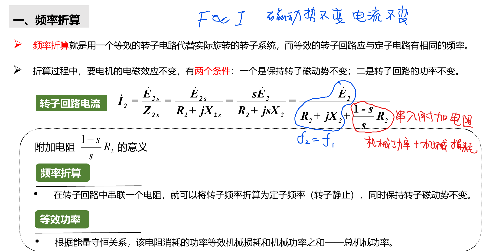
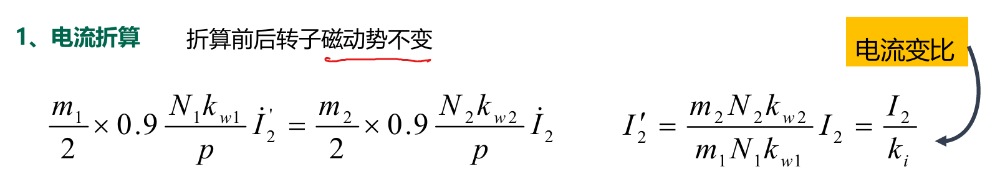
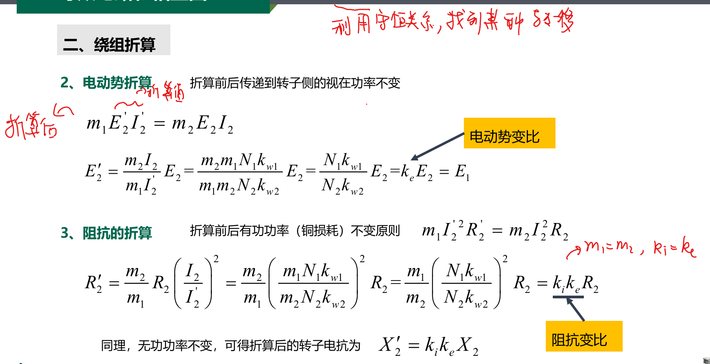
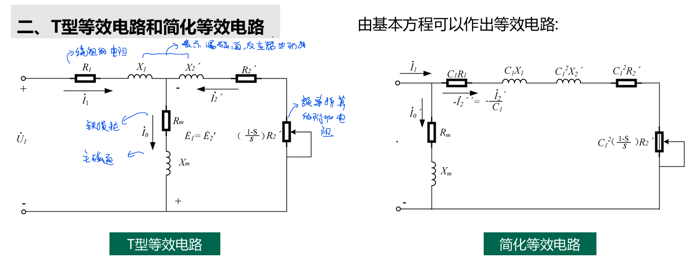
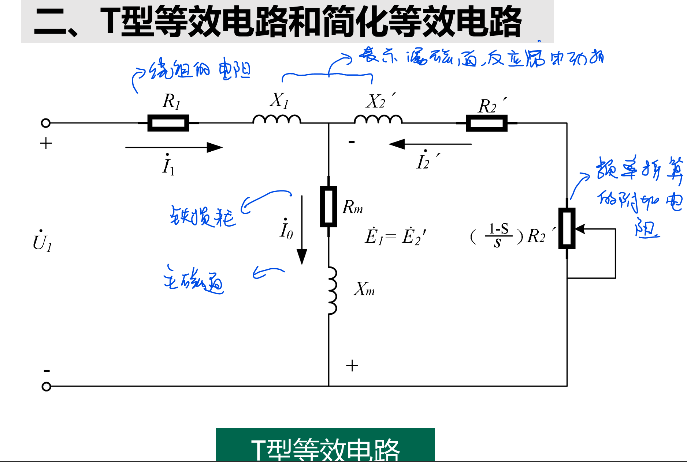
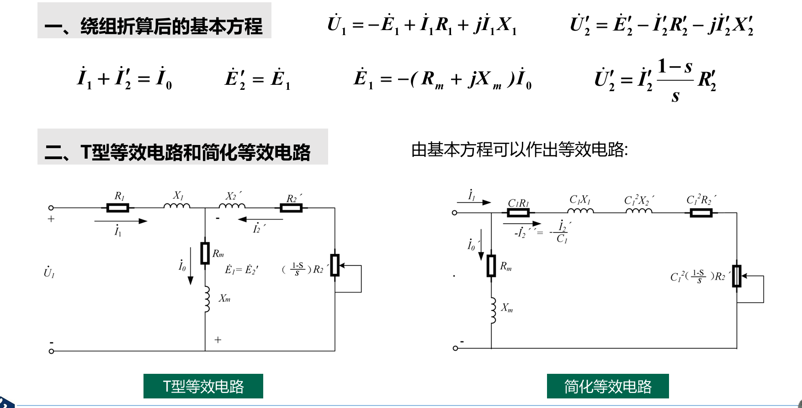

# 三相异步电动机的等效电路和相量图

1. 绕组折算（变比问题）
2. 频率折算（$f_2 = sf_1$）

<!-- @import "[TOC]" {cmd="toc" depthFrom=1 depthTo=6 orderedList=false} -->

<!-- code_chunk_output -->

- [三相异步电动机的等效电路和相量图](#三相异步电动机的等效电路和相量图)
  - [1 频率折算](#1-频率折算)
  - [2 绕组折算](#2-绕组折算)
  - [3 等效电路](#3-等效电路)

<!-- /code_chunk_output -->

## 1 频率折算

## 2 绕组折算

## 3 等效电路

