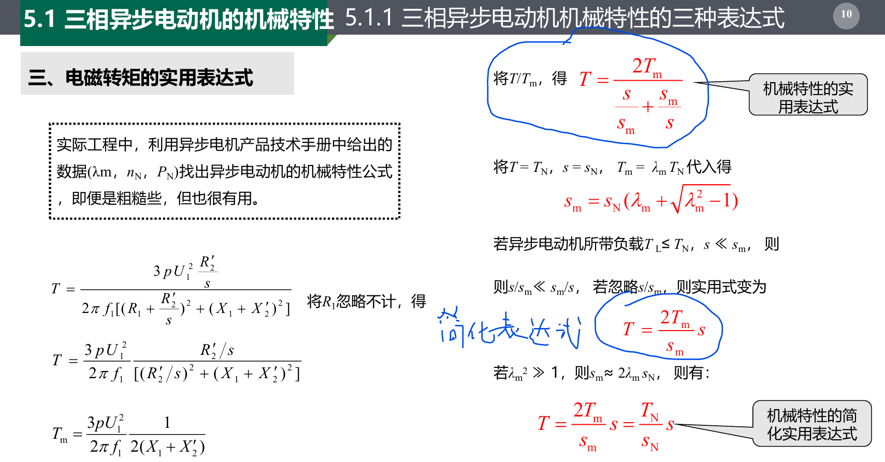

# 三相异步电动机的机械特性

源于机械特性的不同导致直流电机和异步电机的拖动有所不同
这种所谓的不同就是源于异步，即 s 的引入，所以我们的机械特性变成了$T_{em}(S)$,他是一种和转差率之间的关系。

1. $T_{em}$的表达式
   1. 物理表达式（定性）$$T_{em}=C_T\Phi_0I_2^{\prime}\cos\varphi_2$$
   2. 参数表达式（定量）
      1. 四个象限
      2. 电动状态三个特殊点（A，B，C）
      3. 四个参数
         1. A: $n_1$
         2. B：$T_m,S_m$
         3. C：$T_{st}$
   3. 实用表达式（工程）

**机械特性就是转矩和转速的关系**

## 1 物理表达式

## 2 参数表达式

电磁转矩与电源参数（U1、f1）、结构参数（R、X、m、p）和运行参数（s）有关。、

### 2.1 四个象限

### 2.2 三个特殊点

### 2.3 四个参数（特殊点求解）

**使用数学方法求点**
、

## 3 实用表达式

## 4 机械特性

### 4.1 固有机械特性

### 4.2 人为机械特性

## 5 总结

