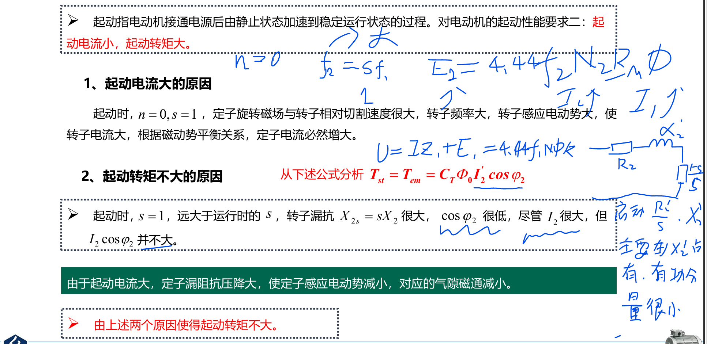
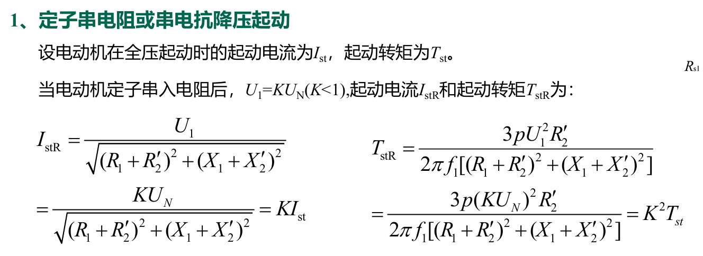
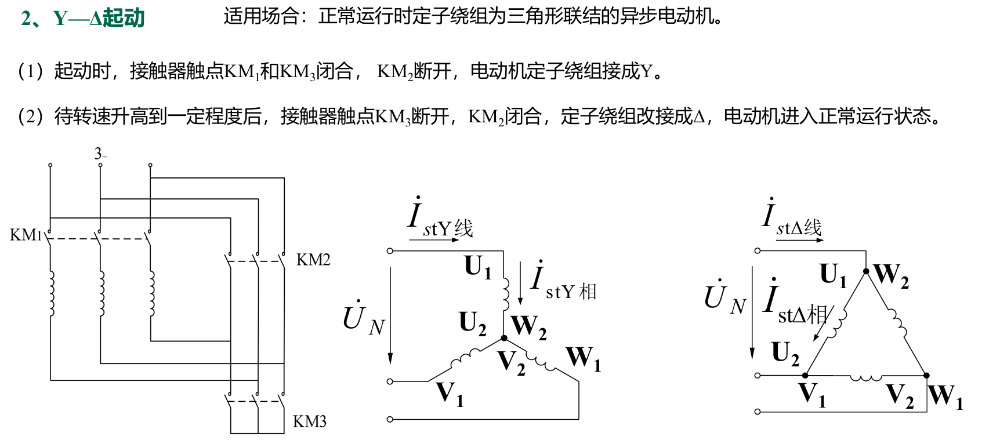
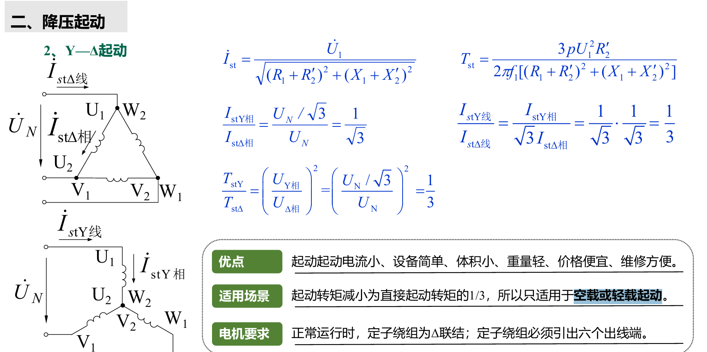
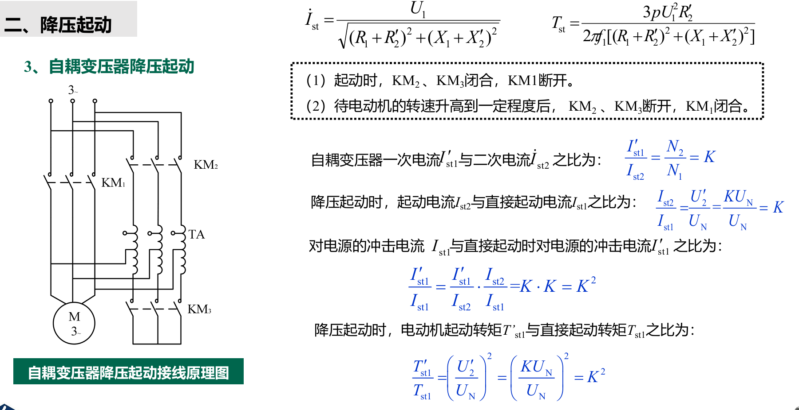
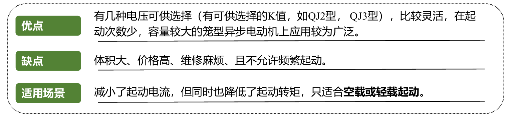
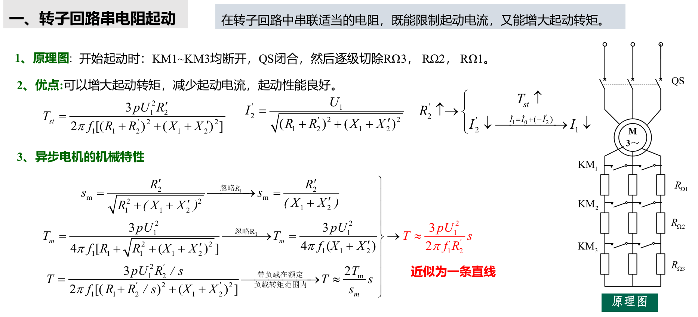
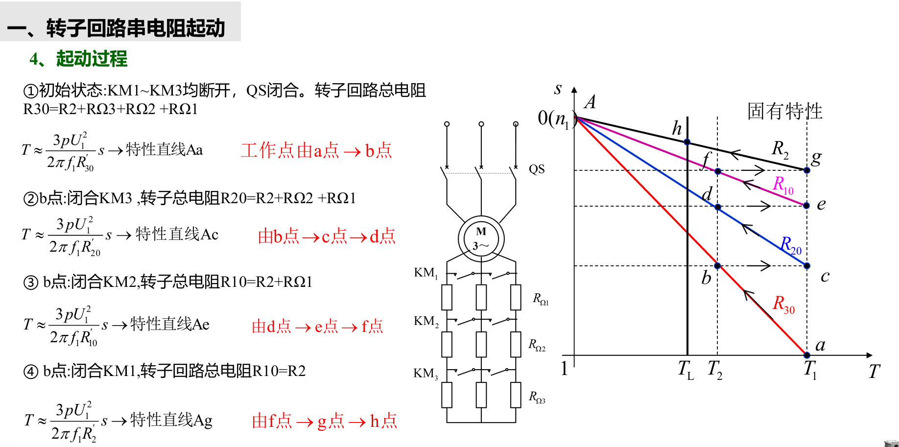
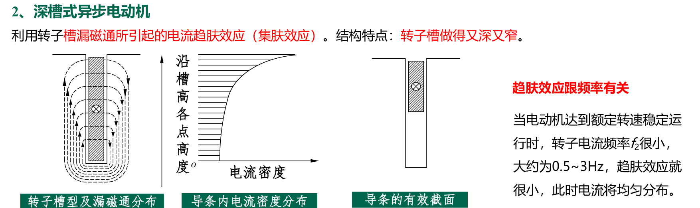
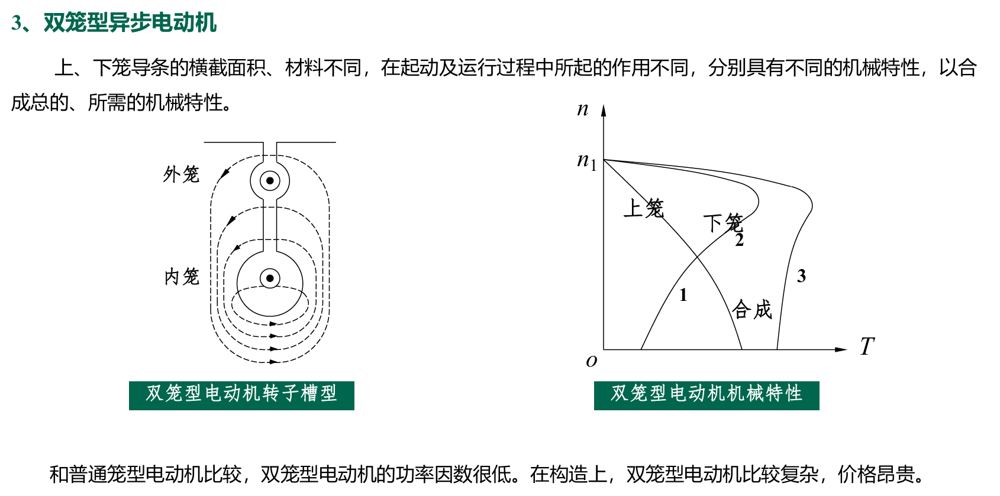

# 三相异步电机的启动
- [三相异步电机的启动](#三相异步电机的启动)
  - [1 直接启动的问题](#1-直接启动的问题)
  - [2 启动方式](#2-启动方式)
    - [2.1 直接启动（\<7.5kW 的小电机）](#21-直接启动75kw-的小电机)
    - [2.2 降压启动](#22-降压启动)
      - [2.2.1 Y—Δ 起动（空载或轻载起动）](#221-yδ-起动空载或轻载起动)
      - [2.2.2 自耦变压器降压起动（空载或轻载起动。）](#222-自耦变压器降压起动空载或轻载起动)
    - [2.3 定子侧串电阻起动（空载或轻载起动）](#23-定子侧串电阻起动空载或轻载起动)
    - [2.4 转子回路串电阻起动（$R\_2$）](#24-转子回路串电阻起动r_2)
      - [2.4.1 绕线型电机](#241-绕线型电机)
      - [2.4.2 笼型电机（趋肤效应）](#242-笼型电机趋肤效应)
        - [2.4.2.1 深槽型](#2421-深槽型)
        - [2.4.2.1 双笼型](#2421-双笼型)
    - [2.5 串频敏变阻器起动](#25-串频敏变阻器起动)
  - [3 总结](#3-总结)

## 1 直接启动的问题

## 2 启动方式

### 2.1 直接启动（<7.5kW 的小电机）

<7.5kW 的小电机

### 2.2 降压启动

#### 2.2.1 Y—Δ 起动（空载或轻载起动）

#### 2.2.2 自耦变压器降压起动（空载或轻载起动。）

### 2.3 定子侧串电阻起动（空载或轻载起动）

相当于降电压启动

### 2.4 转子回路串电阻起动（$R_2$）

增大转子回路电阻的方法，这里分为笼形和绕线型

笼形电子转子已定，只能通过特殊结构进行改进

#### 2.4.1 绕线型电机

#### 2.4.2 笼型电机（趋肤效应）

##### 2.4.2.1 深槽型

越靠近下方的电抗越大，所以电流趋于表面，相当于截面积减小，意味着导体的电阻变大。并且趋肤效应和频率有关，启动时$f_2 = sf_1$非常大，当启动完毕后趋肤效应又减弱。

##### 2.4.2.1 双笼型

启动时候使用外笼，面积小，电阻大。启动完毕偏向于内笼，回归正常。

### 2.5 串频敏变阻器起动

**这种方式类似于趋肤效应的利用频率相关**

## 3 总结
