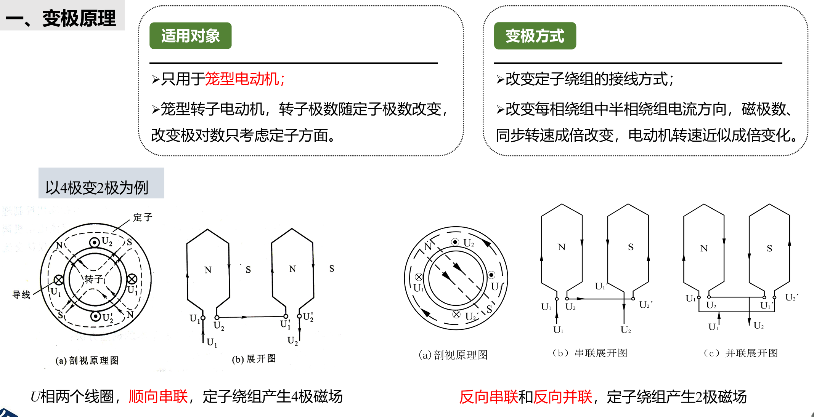
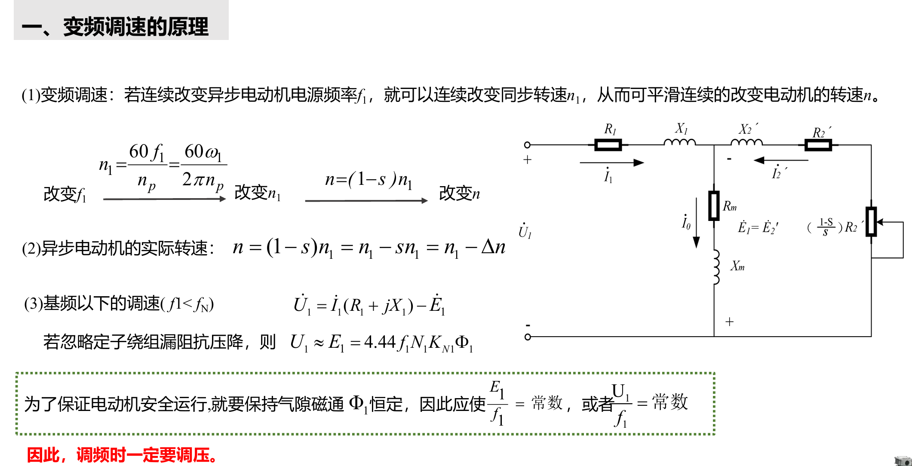

# 三相异步电动机的调速

## 变定子极对数 p 调速。

## 改变电源频率 f 调速。

$$
\begin{cases}基频以下，恒转矩：f_{1}<f_{N}(\frac{U_{1}}{f_{1}}=C)U_{1}\downarrow\\
基频以上，恒功率：f_{1}>f_{N}(U_{1}=U_{N})\frac{U_{1}}{\sqrt{f_{1}}}=C\end{cases}
$$

**转差功率不变性，效率最高**

## 改变转差率 s 调速。
